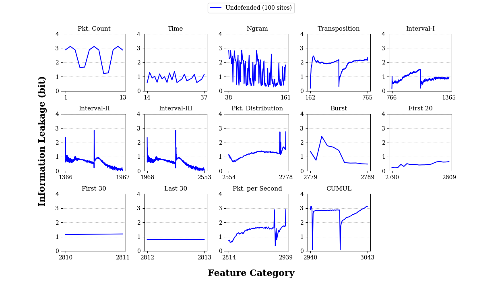

## Notice

This is a ***re-implementation*** of WeFDE [1] framework to measure information leakage for the paper ***Tik-Tok: The Utility of Packet Timing in Website Fingerprinting Attacks*** accepted in **Privacy Enhancing Technologies Symposium (PETS) 2020**.

If you use this implementation in your paper, please include the following papers as citations:

```
[1] Shuai Li, Huajun Guo, and Nicholas Hopper. 2018. Measuring Information Leakage in Website Fingerprinting Attacks and Defenses. In Proceedings of the 2018 ACM SIGSAC Conference on Computer and Communications Security (CCS '18). ACM, New York, NY, USA, 1977-1992. DOI:10.1145/3243734.3243832

[2] Mohammad Saidur Rahman, Payap Sirinam, Nate Mathews, Kantha Girish Gangadhara, and Matthew Wright. 2020. Tik-Tok: The Utility of Packet Timing in Website Fingerprinting Attacks. In Proceedings of the Privacy Enhancing Technologies Symposium (PETS), Montréal, Canada.
```

## Introduction

Purpose of this project is to reproduce the WeFDE information leakage results with code which is more user-friendly and expandable.
To achieve this, much of the original Matlab code has been replaced with analogous python code.
The application has also been designed to require minimal steps from the user.
Performing an website fingerprinting information leakage analysis should not require extensive understanding of the underlying analysis mechanisms.

All credit for the design of this system goes to Shuai et. al. [1].


## Project Overview

### Requirements

* Python 3.6+ & ``requirements.txt`` modules

### Roadmap

* [Completed] Closed-world information leakage analysis
* [Completed] Replace Matlab @kde library with native Python implementation
* Open-world analysis extension
* Bootstrapping results verification
* Re-write feature processing scripts to be extendable with additional features

### Organization

#### Data processing
Before information leakage analysis can be performed on a dataset, that dataset must first be transformed to it's feature representation.
This process is handled by the scripts in the ``preprocess`` directory.
At present, this code is a revised variant of the processing scripts seen in the Shuai et. al. public code [2].

The main script processes all files in a nested directory.
Trace files should follow the format defined by Wang et. al. in [3].
Each website trace is saved as a CSV-type file using a space delimiter.
The name given to each transformed trace is the original trace name with ``.feature`` prepended.
These feature files will be loaded during the information leakage analysis.

#### Information leakage analysis

The design of WeFDE can be organized into two components: the **fingerprint modeler** and the **mutual information analyzer**.
The fingerprint modeler constructs kernel density estimators using feature distributions. These estimators are then used to approximate the entropy and information leakage of the features for the dataset. 
The mutual information analyzer is instead responsible for reducing the number of features to be analyzed to only the most important, non-redundant features. It does this via two methods: redundant feature pruning and related feature clustering.
For further details as to the theory behind WeFDE, please read [1].

The main experiment of WeFDE---estimating information leakage for individual and grouped features--is performed by the ``info_leak.py`` script. This script uses the ``fingerprint_modeler.py`` and ``mi_analyzer.py`` components to perform both the individual and combined leakage analysis. This script uses the functions from the ``data_utils.py`` script to load preprocessed feature files from the directory described by the ``--features`` argument. 

The ``info_leak.py`` script saves analysis results in a directory described by the ``--output`` argument. The analysis is performed in two phases: 1) individual feature analysis and 2) combined feature analysis. Each phase saves its results in various files. 

The individual feature analysis phase produces the ``indiv.pkl`` and ``indiv_checkpoint.txt`` files. The ``indiv.pkl`` is a python pickle file which contain a numpy array describing the information leakage results for each feature as they appear in your feature files. The ``indiv_checkpoint.txt`` contains the same information, but in an ascii form. This file is additionally used by the application to resume from a partially finished analysis.

The combined feature analysis phase uses the results from the individual feature analysis to identify important features and group them a combined analysis. This phase produces the ``cleaned.pkl``, ``redundant.pkl``, ``cluster.pkl``, ``distance_matrix.pkl``, and ``prune_checkpoint.txt`` files. The ``cleaned.pkl`` and ``redundant.pkl`` contain the lists of the top features that were identified as non-redundant and redundant (respectively). The ``cluster.pkl`` contains the list of feature clusters identified from the cleaned features list, while the ``distance_matrix.pkl`` contains a 2D numpy array describing the distances between each feature. The ``prune_checkpoint.txt`` contains an ascii representation of the information contained by ``cleaned.pkl``, ``redundant.pkl``, and ``distance_matrix.pkl``; and is used to resume from prior analysis sessions.

The final combined feature leakage value is printed to stdout via the logging utility after the analysis completes. So, be sure to save this information before closing the window in which your session was run. 

#### Results presentation

We have prepared two scripts to visualize the individual leakage and clustering results. The ``leakage.py`` and ``cluster.py`` scripts can be found in the ``graphing`` directory. These scripts use the ``matplotlib`` library to display the leakage and clustering information as a line and bar graph. 

The ``leakage.py`` script can be fed several ``indiv.pkl`` files to plot the individual feature leakage for each feature category over several experiments. The script accepts several ``--file`` and ``--name`` arguments which identify the leakage files and the experiment name under which to plot them. If you have used a custom set of features for your analysis, you will need to adjust the feature category information contained in the ``common.py`` file. 

The ``cluster.py`` script should be provided with a ``cluster.pkl`` and (optionally) a ``redundant.pkl`` file. The information contained in these files are plotted as stacked bar graphs in which each color slice represents the proportion of that feature category belongs to a particular cluster. 

In addition, a simple Random Forests classifier is available in the ``classifier`` directory. The ``rf.py`` script peforms a basic closed-world attack on the dataset using the same processed features as the information leakage analysis. This may be used as a benchmark to compare plain accuracy to the information leakage results.

## Results




## Usage Examples

```bash
TRACE_PATH="/path/to/traces"
FEATURE_PATH="/path/to/features"
LEAKAGE_PATH="/path/to/leakage"
```

###### Data processing

```bash
python preprocess/extract.py --traces "${TRACE_PATH}" --output "${FEATURE_PATH}"
```

###### Information leakage analysis

```bash
python analysis/info_leak.py --features "${FEATURE_PATH}" --output "${LEAKAGE_PATH}" \
                             --n_samples 5000 --nmi_threshold 0.9 --topn 100 --n_procs 8
```

###### Graphing

```bash
python graphing/leakage.py --file "${LEAKAGE_PATH}\indiv.pkl" --name Undefended
```

```bash
python graphing/cluster.py --cluster_file "${LEAKAGE_PATH}\cluster.pkl" \
                           --redundant_file "${LEAKAGE_PATH}\redundant.pkl" \
                           --style "horizontal"
```

###### Random Forests Benchmark

```bash
python classifier/rf.py --features "${FEATURE_PATH}" --output "./benchmark.txt" \
                        --train 0.8
```

## References
[1] Shuai Li, Huajun Guo, and Nicholas Hopper. Measuring Information Leakage in Website Fingerprinting Attacks and Defenses. In ACM Conference on Computer and Communications Security, 2018.

[2] https://github.com/s0irrlor7m/InfoLeakWebsiteFingerprint

[3] Tao Wang. Website fingerprinting: attacks and defenses. PhD thesis, University of Waterloo, 2016.
